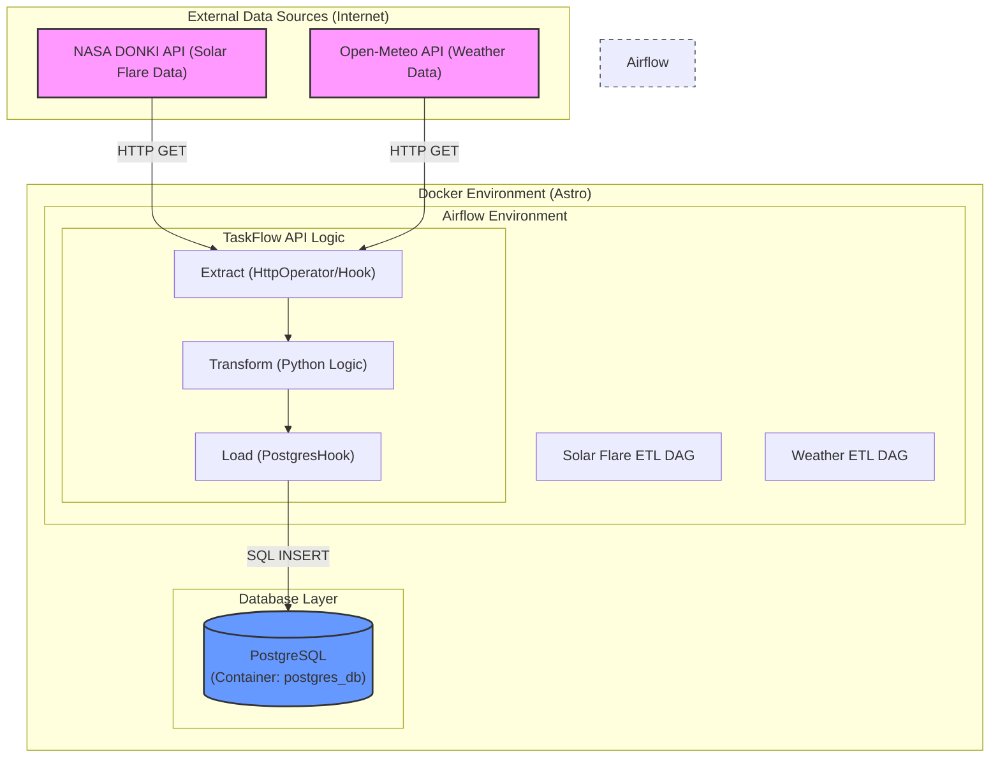
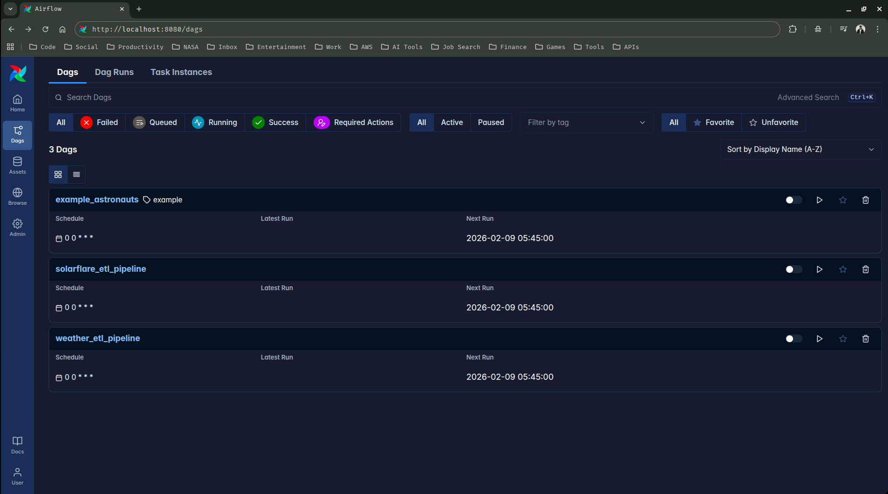
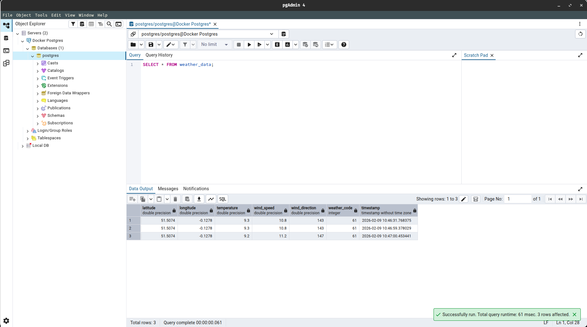

# 🚀 Extract-Transform-Load (ETL) Pipelines

[](https://airflow.apache.org/)
[](https://www.postgresql.org/)
[](https://www.astronomer.io/opensource/)
[](https://www.docker.com/)

A robust project demonstrating Automated ETL (Extract, Transform, Load) pipelines built with **Apache Airflow**, **Docker**, and **PostgreSQL**. This repository features two distinct data pipelines that fetch real-time data from external APIs and store it in a structured database for analysis.

---

## 🧩 Architecture Overview

The pipeline is orchestrated using **Apache Airflow** (Astro Runtime) and uses **PostgreSQL** for data persistence. It consists of multiple DAGs that ingest data from scientific and environmental APIs.



---

## 🌟 Features

### 1. ☀️ NASA Solar Flare Pipeline
- **Extract**: Fetches solar flare event data (DONKI API) from NASA.
- **Transform**: Automatically filters and cleans raw JSON responses to capture key metrics like class type, peak time, and active region numbers.
- **Load**: Persists data into a PostgreSQL table with deduplication logic.

### 2. 🌦️ Open-Meteo Weather Pipeline
- **Extract**: Retrieves current weather data for specific coordinates using the Open-Meteo API.
- **Transform**: Extracts temperature, wind speed, and weather codes into a clean relational format.
- **Load**: Appends time-stamped weather records to a historical database.

---

## 🚀 Getting Started

### Prerequisites
- [Docker & Docker Desktop](https://www.docker.com/products/docker-desktop/)
- [Astro CLI](https://www.astronomer.io/opensource/) (The easiest way to run Airflow locally)

### Installation

1. **Clone the Repository**
   ```bash
   git clone https://github.com/SiddhuShkya/Extract-Transform-Load.git
   cd Extract-Transform-Load
   ```

2. **Initialize & Start Airflow**
   ```bash
   astro dev start
   ```
   *This will start your Airflow environment in Docker containers.*

3. **Access the Airflow UI**
   Open your browser and go to: `http://localhost:8080` (Default: `admin`/`admin`)

---

## ⚙️ Configuration

To run the pipelines, you need to set up the following connections in the Airflow UI (**Admin -> Connections**):

### 1. NASA API Connection
- **Conn Id**: `nasa_api`
- **Conn Type**: `HTTP`
- **Host**: `https://api.nasa.gov`
- **Extra**: `{"api_key": "YOUR_NASA_API_KEY"}`

### 2. Open-Meteo API Connection
- **Conn Id**: `open_meteo_api`
- **Conn Type**: `HTTP`
- **Host**: `https://api.open-meteo.com`

### 3. PostgreSQL Connection
- **Conn Id**: `my_postgres_connection` (used by Solar Flare) / `postgres_default` (used by Weather)
- **Conn Type**: `Postgres`
- **Host**: *Check Docker container logs/inspect for host ip or use `host.docker.internal`*
- **Database/Login/Password**: Default Airflow settings or your custom DB.

---

## 📸 Screenshots

| Weather Dashboard | Solar Flare Pipeline |
| :---: | :---: |
|  |  |

| Weather Data Table | Solar Flare Records |
| :---: | :---: |
|  |  |

---

## 🛠️ Built With

- **Apache Airflow**: Orchestration and scheduling.
- **PostgreSQL**: Relational data storage.
- **Astro CLI**: Workflow development and deployment.
- **Docker**: Containerization.
- **NASA DONKI API**: Solar flare data provider.
- **Open-Meteo API**: Weather data provider.

---

## 📄 License
Distributed under the [MIT License](LICENSE).

---
