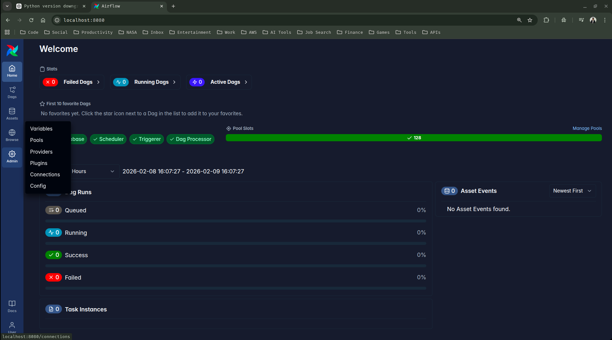
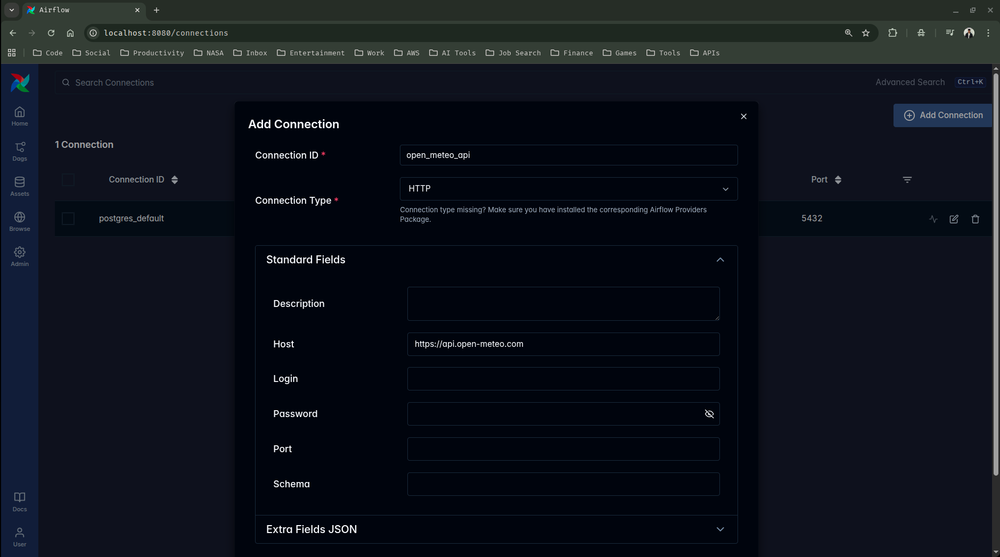
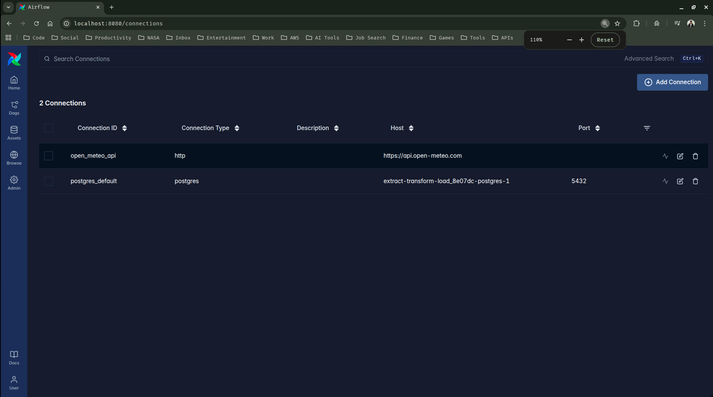
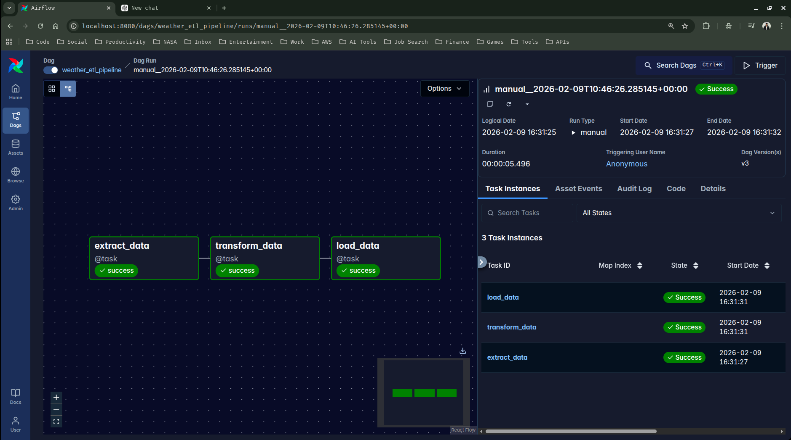
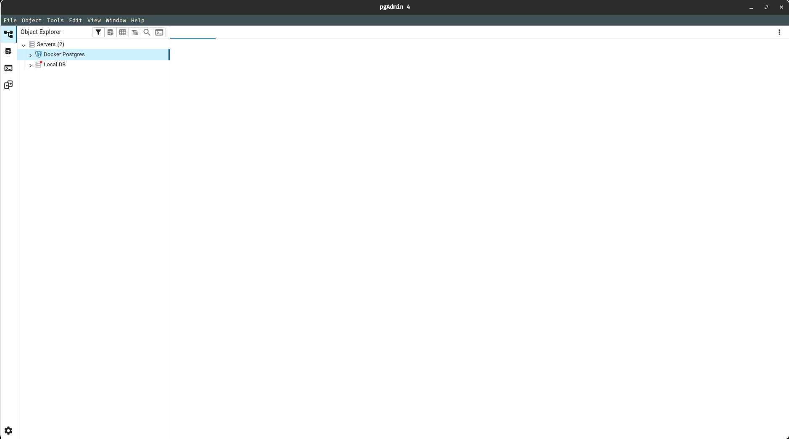
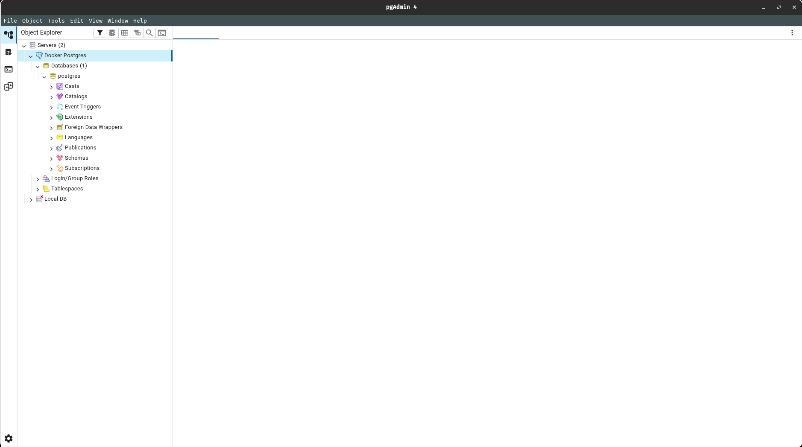
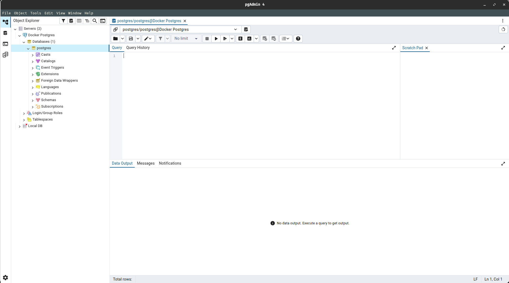

## Weather ETL Pipeline

In this guide, we will build an end-to-end ETL pipeline to collect weather data using Apache Airflow. We will utilize Astronomer to develop, deploy, and orchestrate our DAGs (Directed Acyclic Graphs), ensuring our data pipeline runs reliably on a defined schedule.

---

### 1. Initial Project Structure

> Before initializing our project structure, make sure you have astro cli installed in your machine 

```bash
siddhu@ubuntu:~$ astro version
Astro CLI Version: 1.38.1
```

> If you don't have it installed in your machine, then refer to the below links and follow their steps to install astro cli to your local machine

- [Setting Up Airflow With Astronomer (Astro)](https://github.com/SiddhuShkya/Machine-Learning-Operations/blob/main/docs/Apache-Airflow.md)

- [Astronomer Docs](https://www.astronomer.io/docs/astro/cli/overview)

After installing the astro cli, we can begin setting up our project structure. Follow the below steps

1.1 Clone the github repo and move your current directory to inside it, after that open up your VS-Code and start our project

```sh
siddhu@ubuntu:~/Desktop$ git clone git@github.com:SiddhuShkya/Weather-ETL-Pipeline.git
siddhu@ubuntu:~/Desktop$ cd Weather-ETL-Pipeline/
siddhu@ubuntu:~/Desktop/Weather-ETL-Pipeline$ code .
```

1.2 Open new terminal from inside your vs-code and initialize your new astro project

```sh
siddhu@ubuntu:~/Desktop/Weather-ETL-Pipeline$ astro dev init
/home/siddhu/Desktop/Weather-ETL-Pipeline is not an empty directory. Are you sure you want to initialize a project here? (y/n) y
Initialized empty Astro project in /home/siddhu/Desktop/Weather-ETL-Pipeline
```

1.3 Create a new dag/python script file named 'etl-weather-pipeline.py' inside the dags folder. 

```text
.
├── dags
│   ├── .airflowignore
│   ├── etl-weather-pipeline.py <------------------- # Your new dag file here
│   └── exampledag.py
```

> This file (etl-weather-pipeline.py) is the dag file we will be using to create our workflow and tasks we need to perform in our pipeline.

1.4 Create another file 'docker-compose.yml' file as we are going to run both our airflow (astronomer) & postgres as a docker container.

> Copy paste the below yaml configurations to docker-compose.yml file

```yml
## docker-compose.yml

version: "3.0"

services:
  postgres:
    image: postgres:13
    container_name: postgres_db
    environment:
      POSTGRES_USER: postgres
      POSTGRES_PASSWORD: postgres
      POSTGRES_DB: postgres
    ports:
      - "5432:5432"
    volumes:
      - postgres_data:/var/lib/postgresql/data
    networks:
      - airflow_network

volumes:
  postgres_data:

networks:
  airflow_network:
    external: false
```

1.5 Add some necessary dependencies requyired to run this project

```text
## requirements.txt

apache-airflow-providers-http
apache-airflow-providers-postgres
```

1.6 Create a python virtual environment (venv) to activate for this project and install the above dependencies

```sh
siddhu@ubuntu:~/Desktop/Extract-Transform-Load$ source venv/bin/activate
(venv) siddhu@ubuntu:~/Desktop/Extract-Transform-Load$ pip install -r requirements.txt 
```

> Your final project structure should look something like the below:

```text
.
├── airflow_settings.yaml
├── .astro
│   ├── config.yaml
│   ├── dag_integrity_exceptions.txt
│   └── test_dag_integrity_default.py
├── dags
│   ├── .airflowignore
│   ├── etl-weather-pipeline.py <------------------- # Your new dag file here
│   └── exampledag.py
├── Dockerfile
├── docker-compose.yml <------------------- # Your docker configuration
├── .dockerignore
├── .env
├── .git
├── .gitignore
├── include
├── LICENSE
├── packages.txt
├── plugins
├── README.md
├── requirements.txt
├── screenshots
└── tests
└── venv
```

1.7 Add, commit and push the changes to our github

```sh
siddhu@ubuntu:~/Desktop/Weather-ETL-Pipeline$ git add .
siddhu@ubuntu:~/Desktop/Weather-ETL-Pipeline$ git commit -m 'Initial Project Structure'
siddhu@ubuntu:~/Desktop/Weather-ETL-Pipeline$ git push origin main
```

---

### 2. Weather ETL DAG

In this section we are going to implement our DAG for our weather ETL pipeline. We will also run the project using the astro command

2.1 Copy paste the below python script to your previously created python file (etl-weather-pipeline.py)

```python
## dags/etl-weather-pipeline.py

import pendulum
from airflow import DAG
from airflow.providers.http.hooks.http import HttpHook
from airflow.providers.postgres.hooks.postgres import PostgresHook
from airflow.sdk import task

LATITUDE = "51.5074"
LONGITUDE = "-0.1278"

POSTGRES_CONN_ID = "my_postgres_connection"
API_CONN_ID = "open_meteo_api"

default_args = {"owner": "airflow", "retries": 3}

with DAG(
    dag_id="weather_etl_pipeline",
    default_args=default_args,
    start_date=pendulum.datetime(2025, 1, 1, tz="UTC"),
    schedule="@daily",
    catchup=False,
) as dags:

    @task
    def extract_data():
        http_hook = HttpHook(http_conn_id=API_CONN_ID, method="GET")
        params = {"latitude": LATITUDE, "longitude": LONGITUDE, "current_weather": True}
        response = http_hook.run(endpoint="/v1/forecast", data=params)

        if response.status_code == 200:
            return response.json()
        else:
            raise Exception(f"Failed to fetch weather data: {response.status_code}")

    @task
    def transform_data(weather_data):
        current_weather = weather_data["current_weather"]
        transformed_data = {
            "latitude": LATITUDE,
            "longitude": LONGITUDE,
            "temperature": current_weather["temperature"],
            "wind_speed": current_weather["windspeed"],
            "wind_direction": current_weather["winddirection"],
            "weather_code": current_weather["weathercode"],
        }
        return transformed_data

    @task
    def load_data(transformed_data):
        pg_hook = PostgresHook(postgres_conn_id=POSTGRES_CONN_ID)
        # create table if not exists
        pg_hook.run("""
        CREATE TABLE IF NOT EXISTS weather_data (
            latitude FLOAT,
            longitude FLOAT,
            temperature FLOAT,
            wind_speed FLOAT,
            wind_direction FLOAT,
            weather_code INT,
            timestamp TIMESTAMP DEFAULT CURRENT_TIMESTAMP
        );
        """)
        # insert data
        pg_hook.run(
            """
            INSERT INTO weather_data (
                latitude, longitude, temperature, wind_speed, wind_direction, weather_code
            ) VALUES (%s, %s, %s, %s, %s, %s)
            """,
            parameters=(
                transformed_data["latitude"],
                transformed_data["longitude"],
                transformed_data["temperature"],
                transformed_data["wind_speed"],
                transformed_data["wind_direction"],
                transformed_data["weather_code"],
            ),
        )

    weather_data = extract_data()
    transformed_data = transform_data(weather_data)
    load_data(transformed_data)
```

2.2 Run your astro project to view your above dag.

> Before starting the project make sure that your'e docker is running in the background.

```sh
siddhu@ubuntu:~$ sudo systemctl status docker
```

> [!IMPORTANT]
> If your docker is not running in the background, start it by opening the docker desktop app from your device.

> Start the astro airflow project

```sh
(venv) siddhu@ubuntu:~/Desktop/Extract-Transform-Load$ astro dev start
✔ Project image has been updated
✔ Project started
➤ Airflow UI: http://localhost:8080
➤ Postgres Database: postgresql://localhost:5432/postgres
➤ The default Postgres DB credentials are: postgres:postgres
(venv) siddhu@ubuntu:~/Desktop/Extract-Transform-Load$ Opening in existing browser session.
```

> View your dags from the airflow ui:

```text
http://localhost:8080/dags
```


> You can also view the conatiners that are running in your laptop from the docker desktop app.


---

### 3. Set Up Airflow Connection

Now lets set up the below required connections from the airflow ui, needed to run our ETL pipeline:

```python
POSTGRES_CONN_ID = "my_postgres_connection"
API_CONN_ID = "open_meteo_api"
```

3.1 Go to the airflow ui, and from there click on the Admin tab. You should be able to see the option for connections, Click it.



3.2 Add the two required connections:

> Add the 'my_postgres_connection' connection

- Connection ID -> my_postgres_connection
- Connection Type -> Postgres
- Host -> extract-transform-load_8e07dc-postgres-1 (Name of the container running)
- Login -> postgres
- Password -> postgres
- Port -> 5432 
- Database -> postgres


> Add the open_meteo_api connection

- Connection ID -> open_meteo_api
- Connection Type -> HTTP
- Host -> https://api.open-meteo.com



3.3 You should be able to see the 2 connections you recently created



---

### 4. Trigger/Execute your dag

4.1 Go to your dags tab, and click on your dag.


4.2 Click on the trigger button at the top right side to trigger/execute the pipeline.



> If you see the graph borders turn green then that means that our pipeline is working successfully.

---

### 5. View your loaded data 

Since, we are running our postgresql as a docker container, we cannot directly open and see our database. We will have to use a third party sql software to view our postgres database.

5.1 Open your PgAdmin App



5.2 Connect and extend to Docker Postgres Server



5.3 Right click on postgres database and open up the query tool



5.3 Copy paste and run the below query

```sql
SELECT * FROM weather_data;
```


> You should be able to view the weather data table along with the data that were acquired using our ETL pipeline.

5.4 You can now stop your project.

```sh
(venv) siddhu@ubuntu:~/Desktop/Extract-Transform-Load$ astro dev stop
✔ Project stopped
```

---

# <div align="center">Thank You for Going Through This Guide! 🙏✨</div>
